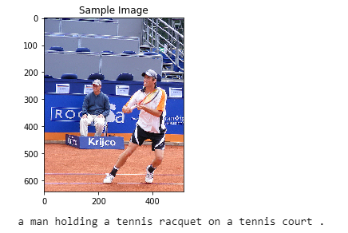
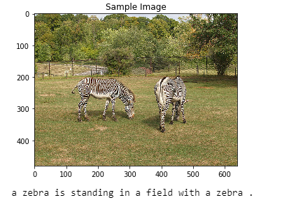

# Image Captioning 
## Objective 
In this project an neural network that captions input images was developed.
The information of the given image is extacted from a CNN and fed into a RNN architecture. After the RNN has received the infromation vector from the CNN, it predicts the letters of the caption to ne created.

## Results 

The following pictures show some good  captions the network guessed.

#### Good Captions

