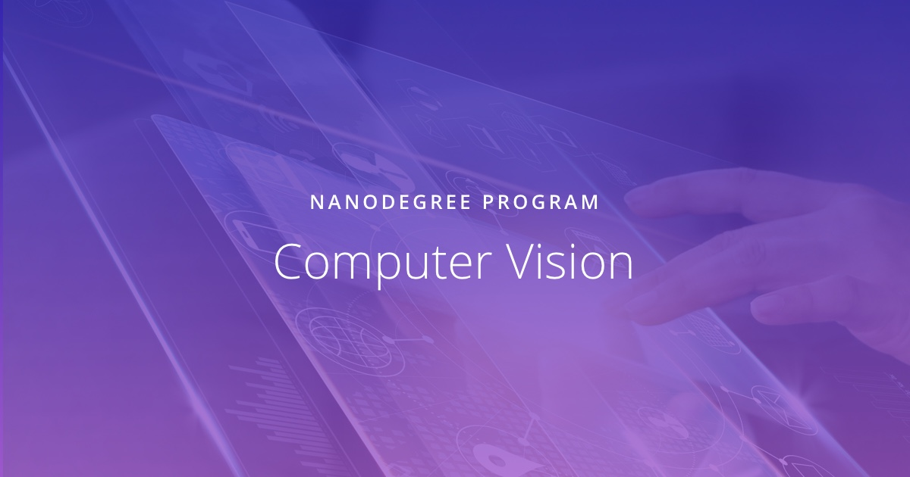

# Udacity Nanodegree  Computer Vision

  

This repository contains the projects made during the Udacity Nanodegree in Computer Vision.

## Projects 

The three main projects from the degree are:
- Facial Keypoint Recognition 
- Image Captioning 
- 